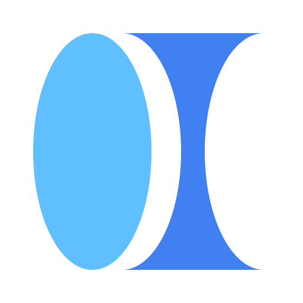

  

    
  

# OpticExplorer

Optic Explorer is a cloud based optical simulation and design application. It allows you to simulate and design optical systems using just your web browser. You can even run it on your tablet or phone.

Welcome Screen

Desktop

## Requirements

### 1. PHP 8.1+

The back end code is built upon Laravel10 which relies upon PHP 8.1 or later.

### 2. Web Server

This application requires Apache or another similar web server.

### 2. SQL Database

SQL is used for storing user, authentication, and academic information.

## Installation

Please follow the instructions in [documentation/INSTALL.md](documentation/INSTALL.md) to install the software on your web server.   If you would like some pointers for configuring your web server, see:  [documentation/CONFIG.md](documentation/CONFIG.md).

<!-- LICENSE -->
## License

Distributed under the Sustainable Use License which allows urestricted use of the software but does not allow you to commercialize it. See [LICENSE.md](LICENSE.md) for more information.

<!-- CONTACT -->
## Contact

Abe Megahed - (mailto:amegahed@wisc.edu) - email
