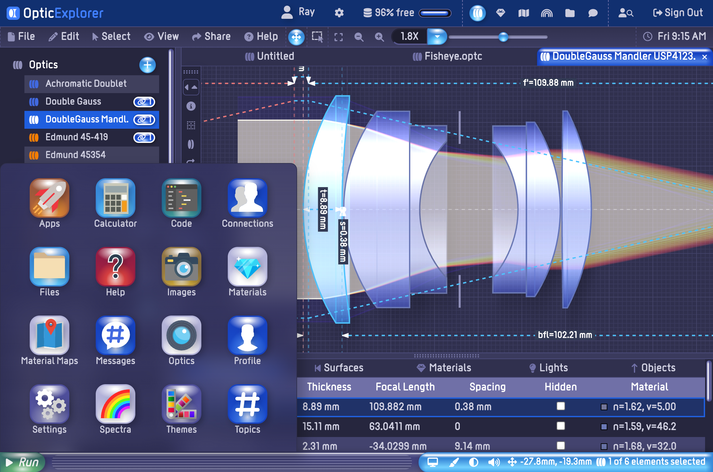

  

    
  

# OpticExplorer

Optic Explorer is a cloud based optical simulation and design application. It allows you to simulate and design optical systems using just your web browser. You can even run it on your tablet or phone.

Welcome Screen

Desktop

## Features

- Simulate optical systems using ray tracing analysis.
- Import and export optic files in .ZMX or .OPTC formats.
- Explore thousands of designs from the OpticExplorer database.
- Simulate distant lights, point lights, light rays, and light beams.
- Explore optical materials including refraction, reflection, transmission, and absorption characteristics.
- Explore material libraries from glass producers such as Schott, Ohara, CDGM, and others.
- Easy to install - with a one-step Docker installation.
- Easy to use - works like the desktop and mobile systems you already know.
- Platform independent - desktop or mobile.
- Self-hostable - run on your own server.

## Benefits

- Explore and learn about optical systems.
- Perform optical analysis.
- Enables photographers to better understand their equiptment.
- Use in classrooms to teach geometric optics.
- Manage and share your optical designs.

## Live Demo

You can create an account and explore the features and benefits of the platform at [www.opticexplorer.com](https://www.opticexplorer.com).

## Installation

Please follow the instructions in [www.chatkitty.org/#installation](https://www.opticexplorer.com/#installation) to install the software on your computer or web server.

## Instructions

See the [OpticExplorer User Guide](https://www.opticexplorer.com/#help) for instructions on how to use the platform.

## License

Distributed under the IndieSource License which allows unrestricted use of the software except by very large corporations. See [LICENSE.md](LICENSE.md) for more information.

## Contact

mailto:admin@opticexplorer.com
